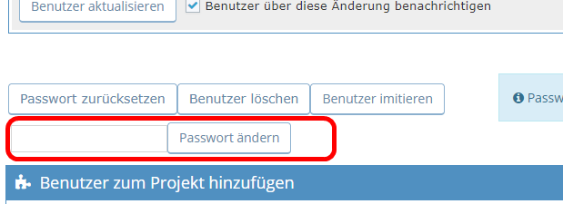

# AdminSetPassword for MantisBT
This plugin for Mantis Bugtracker allows administrators to set a new password directly.

## Requierements
Works with MantisBT 2.*.
Tested with MantisBT 2.22.0

## Description
This plugin for Mantis Bugtracker allows administrators to set a new password directly on the edit user page.
If you installed this plugin, you get a password input field on `manage_user_edit_page.php` and a button to set the new password - that's all.

No configuration options, no config page. And nothing to patch in your mantis installation.

## Screenshot

## Changelog
### 1.0.0
* Ready for MantisBT Version 2.* (older version leave inside his separate branch)

### 0.1.2
* Last stable version, crerated by [Heiko Schneider-Lange}(https://github.com/langerheiko)
